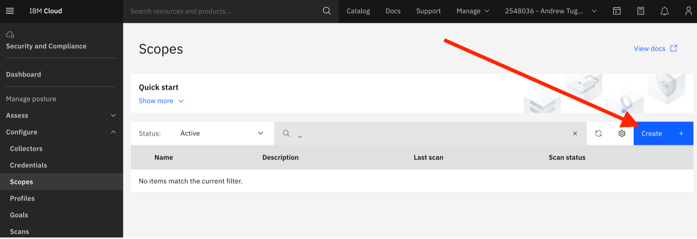
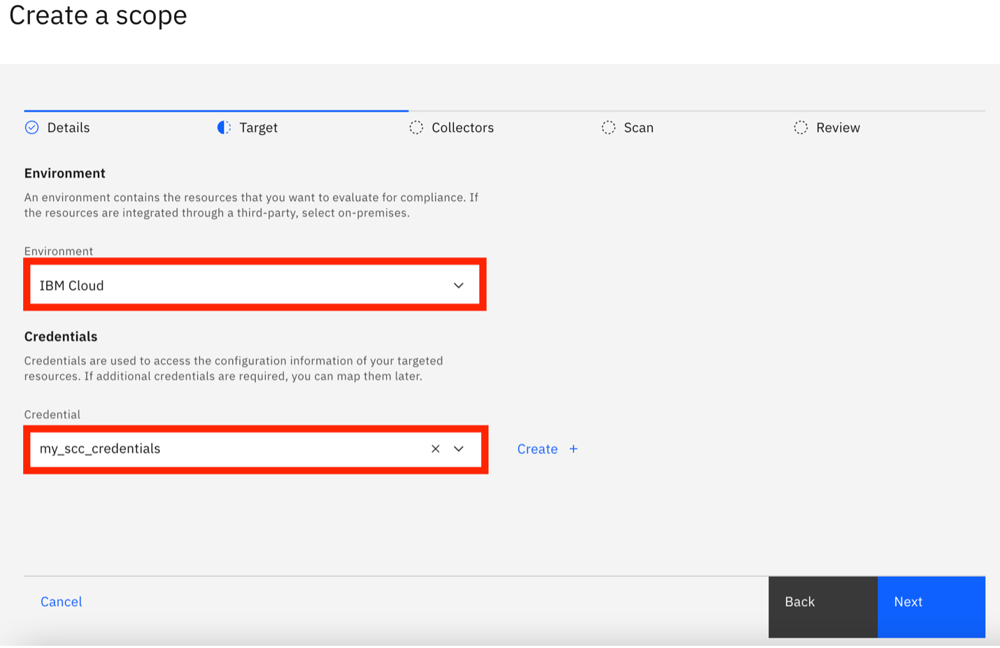

summary: Cloud Innovation Summit
id: Cloud Innovation Summit
categories: Sample
tags: medium
status: Published

# Cloud Innovation Summit
<!-- ------------------------ -->
## Introduction

### HANDS-ON LAB: 

### IBM CLOUD SECURITY AND COMPLIANCE CENTER 

### IBM CLOUD INNOVATION SUMMIT 

### SEPTEMBER 20TH, 2022 

Welcome to the Security and Compliance Center hands-on lab! Today, you’ll have a chance to work with a live IBM Cloud environment and illustrate the functionality of the IBM Cloud Security and Compliance Center. 

 

Phase 1 is the portion of this document that will encompass the hands-on steps. During this section, please don’t hesitate to stop and ask questions if you get stuck. We hope you’re able to get through all of it in the time allotted today, but if you don’t, we’ll keep the environment live for a few days afterwards so that you can continue your learning after this session. 

 

We’ll start with a brief overview of SCC (Phase 0), then we’ll scan an IBM Cloud environment (Phase 1). This will give us a compliance score, and will identify portions of our environment that are either vulnerable from a security perspective, or non-compliant and leaving us susceptible to fines (Phase 1.1). 

 

Then, we’ll make improvements (remediate) and changes to our environment to improve our security and compliance posture (Phase 1.2). We’ll rescan the environment through SCC (Phase 1.3) and see how much we were able to improve (1.4). 

 

Lastly, we’ll review existing Azure scans (Phase 2) and IBM Cloud Satellite scans (Phase 3) to learn about different types of environments SCC is capable of scanning. Finally, we’ll wrap everything up and discuss next steps (Phase 4). 

 

Let’s get started! 

<!-- ------------------------ -->
## Phase 0 – Explore the Architecture and the Security and Compliance Center

### IBM Cloud Security and Compliance Center: Overview and Key Definitions 

 

The IBM Cloud Security and Compliance Center (SCC) helps customers achieve continuous security and compliance of their on-premises and Cloud resources (including IBM Cloud, Azure, AWS, and GCP). The SCC helps customers prevent misconfigurations in their environment that could result in significant fines stemming from violating government regulations. In today’s world, security threats are constantly changing, and the SCC helps customers mitigate incoming security threats by ensuring their environment adheres to key security configurations. 

 

### Collector: 

 

Think of a collector as the machine executing the scan of your environment. It’s effectively a computer executing the program that compares your environment against a set of controls, and outputs the compliance report. 

Reference: https://cloud.ibm.com/docs/security-compliance?topic=security-compliance-collector 

 

### Credentials: 

 

The collector requires authorization to access your resources and run its validations. Configuring credentials accomplishes exactly this. For IBM Cloud scans, this is simply an API key.  

 

### Scope: 

 

A scope is the environment that you’re electing to scan. For example, your scope could be an IBM Cloud account, or it could be limited to a specific resource group. 

 

### Goal: 

 

A goal is the desired state/configuration for your environment.  

A goal is used to determine if your environment is meeting an industry control. 

Industry controls are rules and regulations that an organization must adhere to. 

 

*Note: we’ll be exploring goals later in the lab. 

 

### Profile:  

 

A profile is a collection of industry controls.  

 

Profiles are designed make your life even easier – by defining the controls that your organization is focused on. 

 

And, even better: using our predefined profiles saves you the effort of creating this definition on your own. We have many predefined profiles available, and if there is not currently a profile that matches your needs perfectly, please contact your IBM account representative who can provide additional support. 

 

*Note: we’ll be exploring various predefined profiles later in the lab as well. 

<!-- ------------------------ -->
## Phase 0.1 – Confirm Your Resource Group

To start the lab, your web browser should already be logged into the IBM Cloud portal: https://cloud.ibm.com.

If for some reason this isn’t the case, go ahead and navigate to that link and notify your instructor who will provide you with login credentials.

The first piece of information that we need to complete this lab is our unique resource group. We’ll reference this resource group a few times throughout the lab. A resource group is a logical grouping of resources into a virtual “bucket” to make it easier to manage our resources. We’ll talk a bit more about resource groups later on, but for now, you need to make sure you know which resource group you’ll be using for today’s lab.

To confirm your resource group, in the top left of the IBM Cloud Portal, click on the following icon to use the flyout menu:

Then click on “Resource List” from the flyout menu.

Take a moment to review the resources that you have access to. You can expand the “VPC Infrastructure” and “Storage” sections. 

You’ll notice that you have access to your own:

-	Cloud Object Storage (COS) instance
-	Virtual Private Cloud
    - Your own isolated network address space in IBM Cloud
-	Virtual Server Instance
    - Your own virtual machine hosted in IBM Cloud
-	Other VPC resources
    - Including a Network Security Group, and Access Control List, which we’ll talk about more later.

For right now, take note of the resource group that these resources are located in. Your resource group will be named something like: “rg” and a number between 1 and 30. For example, the resource group in the screenshot below is named “rg30” -- make sure you remember your resource group name for a couple of the steps in this lab!

If you forget your resource group at any point, you can navigate back to the “Resource List,” or you can quickly click on the icon in the top right to reference your username, which will correspond to your resource group name!

For example, “lab user30” is the user account in the screenshot below, and lab user30’s resource group is “rg30.” We’ve created a unique user for your, and the number in your username corresponds to your resource group name as well.

<!-- ------------------------ -->
## Phase 0.2 – Navigate to the Security and Compliance Center and Explore

Now, let’s navigate to the Security and Compliance Center, which can be accomplished a few different ways. We’ll simply select “Security and Compliance” from the flyout menu on the left side of the Cloud portal:

Click this icon to open the flyout menu:

Then select “Security and Compliance:”

Take a moment to familiarize yourself with the SCC navigation pane on the left side of your screen. Feel free explore the “Dashboard” option. Your dashboard may initially have less data than the screenshot below!

<!-- ------------------------ -->
## Phase 1 – Scan the IBM Cloud Environment

Now that you’ve have a chance to briefly explore the IBM Cloud portal, this next phase will involve a series of steps to conduct an initial security and compliance scan of our environment. We need to understand the current state of our environment – are there any security issues in our IBM Cloud environment that could leave our organization vulnerable to a breach? Are there any misconfigurations in our Cloud resources that could result in us having to pay a fine? We’ll find all of that out by scanning our IBM Cloud environment in via the Security and Compliance Center. 

Start by navigating to “Scopes” in the Security and Compliance Center. You can find “Scopes” under the “Configure” drop-down menu on the left-hand side of your screen, as shown in the screenshot below.

Once you’re there, go ahead and click “Create” to launch the scope creation wizard.

Enter a name for your scope (and optionally, you can add a description). For the purposes of this lab, you may want to include your initials in the name of your scope to make it easier to identify in the lab environment. For example, I might name my scope “alt-scope” or similar.

Note: for complex environments, it’s advised to use strategic naming conventions and to supply descriptions for your scopes. 

Once you’ve done that, click “next.”

In the “target” blade of the wizard, select “IBM Cloud” in the “Environment” drop-down menu, and select “my_scc_credentials” from the “Credentials” drop-down menu. 

Note: For the purposes of this lab, the credentials that your SCC scan needs to run have already been created for you to use (my_scc_credentials). For IBM Cloud environments, creating credentials is done by supplying an IBM Cloud API Key to SCC. We don’t need to complete that step since the credentials are already created!

Once you’ve selected “IBM Cloud” as your environment and “my_scc_credentials” for your credential, click “Next.”

