summary: Cloud Innovation Summit
id: Cloud Innovation Summit
categories: Sample
tags: medium
status: Published

# Cloud Innovation Summit
<!-- ------------------------ -->
## Introduction

### HANDS-ON LAB: 

### IBM CLOUD SECURITY AND COMPLIANCE CENTER 

### IBM CLOUD INNOVATION SUMMIT 

### OCTOBER 12TH, 2022 

Welcome to the Security and Compliance Center hands-on lab! Today, you’ll have a chance to work with a live IBM Cloud environment and illustrate the functionality of the IBM Cloud Security and Compliance Center. 

 

Phase 1 is the portion of this document that will encompass the hands-on steps. During this section, please don’t hesitate to stop and ask questions if you get stuck. We hope you’re able to get through all of it in the time allotted today, but if you don’t, we’ll keep the environment live for a few days afterwards so that you can continue your learning after this session. 

 

We’ll start with a brief overview of SCC (Phase 0), then we’ll scan an IBM Cloud environment (Phase 1). This will give us a compliance score, and will identify portions of our environment that are either vulnerable from a security perspective, or non-compliant and leaving us susceptible to fines (Phase 1.1). 

 

Then, we’ll make improvements (remediate) and changes to our environment to improve our security and compliance posture (Phase 1.2). We’ll rescan the environment through SCC (Phase 1.3) and see how much we were able to improve (1.4). 

 

Lastly, we’ll review existing Azure scans (Phase 2) and IBM Cloud Satellite scans (Phase 3) to learn about different types of environments SCC is capable of scanning. Finally, we’ll wrap everything up and discuss next steps (Phase 4). 

 

Let’s get started! 

<!-- ------------------------ -->

## Phase 0 - Meet the Customer: SecureBank, Ltd 

Throughout this lab, we’ll make reference to a fictitious customer, SecureBank, Ltd. SecureBank is a local bank that strives to provide a modern and unique experience to their customers. They may be small, but they they’re ambitious, and they have lofty goals when it comes to testing and releasing new software in the form of new features for their customers. They’re in the process of modernizing some of their key software applications, including their main mobile banking application, used by the vast majority of their customers. 

 

Like most banks, insurance companies, and other financial institutions, they are subject to various compliance regulations and are audited regularly. However, when it comes to maintaining their security posture and key security configurations in their Cloud environments, they tend to take a laissez faire approach. Their engineering and development teams are so focused on releasing new features that security is typically an afterthought. They’ve hired top application developers and DevOps engineers, but their skillsets in the realm of security are lackluster. 

 

Recently, they’ve been hit with some hefty fines from the SEC for a lack of compliance for several controls. SecureBank recently hired a new Chief Information Security Officer (CISO), as well as a new Lead Security Engineer whose primary goal is to embark on a holistic review of the security configurations in their Cloud infrastructure and make sure everything is up to code, so to speak.  

 

Kalin Ux, Chief Information Security Officer (CISO) 

Gene Hackman, Lead Security Engineer 

 

SecureBank is evaluating the IBM Cloud Security and Compliance Center to help them maintain their security posture. 

## Phase 0.1 – Explore the Architecture and the Security and Compliance Center

### IBM Cloud Security and Compliance Center: Overview and Key Definitions 

 

The IBM Cloud Security and Compliance Center (SCC) helps customers achieve continuous security and compliance of their on-premises and Cloud resources (including IBM Cloud, Azure, AWS, and GCP). The SCC helps customers prevent misconfigurations in their environment that could result in significant fines stemming from violating government regulations. In today’s world, security threats are constantly changing, and the SCC helps customers mitigate incoming security threats by ensuring their environment adheres to key security configurations. 

 

### Collector: 

 

Think of a collector as the machine executing the scan of your environment. It’s effectively a computer executing the program that compares your environment against a set of controls, and outputs the compliance report. 

Reference: https://cloud.ibm.com/docs/security-compliance?topic=security-compliance-collector 

 

### Credentials: 

 

The collector requires authorization to access your resources and run its validations. Configuring credentials accomplishes exactly this. For IBM Cloud scans, this is simply an API key.  

 

### Scope: 

 

A scope is the environment that you’re electing to scan. For example, your scope could be an IBM Cloud account, or it could be limited to a specific resource group. 

 

### Goal: 

 

A goal is the desired state/configuration for your environment.  

A goal is used to determine if your environment is meeting an industry control. 

Industry controls are rules and regulations that an organization must adhere to. 

 

*Note: we’ll be exploring goals later in the lab. 

 

### Profile:  

 

A profile is a collection of industry controls.  

 

Profiles are designed make your life even easier – by defining the controls that your organization is focused on. 

 

And, even better: using our predefined profiles saves you the effort of creating this definition on your own. We have many predefined profiles available, and if there is not currently a profile that matches your needs perfectly, please contact your IBM account representative who can provide additional support. 

 

*Note: we’ll be exploring various predefined profiles later in the lab as well. 

<!-- ------------------------ -->
## Phase 0.2 – Confirm Your Resource Group

To start the lab, your web browser should already be logged into the IBM Cloud portal: https://cloud.ibm.com.

If for some reason this isn’t the case, go ahead and navigate to that link and notify your instructor who will provide you with login credentials.

The first piece of information that we need to complete this lab is our unique resource group. We’ll reference this resource group a few times throughout the lab. A resource group is a logical grouping of resources into a virtual “bucket” to make it easier to manage our resources. We’ll talk a bit more about resource groups later on, but for now, you need to make sure you know which resource group you’ll be using for today’s lab.

To confirm your resource group, in the top left of the IBM Cloud Portal, click on the following icon to use the flyout menu:

Then click on “Resource List” from the flyout menu.

Take a moment to review the resources that you have access to. You can expand the “VPC Infrastructure” and “Storage” sections. 

You’ll notice that you have access to your own:

-	Cloud Object Storage (COS) instance
-	Virtual Private Cloud
    - Your own isolated network address space in IBM Cloud
-	Virtual Server Instance
    - Your own virtual machine hosted in IBM Cloud
-	Other VPC resources
    - Including a Network Security Group, and Access Control List, which we’ll talk about more later.

For right now, take note of the resource group that these resources are located in. Your resource group will be named something like: “rg” and a number between 1 and 30. For example, the resource group in the screenshot below is named “rg30” -- make sure you remember your resource group name for a couple of the steps in this lab!

If you forget your resource group at any point, you can navigate back to the “Resource List,” or you can quickly click on the icon in the top right to reference your username, which will correspond to your resource group name!

For example, “lab user30” is the user account in the screenshot below, and lab user30’s resource group is “rg30.” We’ve created a unique user for your, and the number in your username corresponds to your resource group name as well.

<!-- ------------------------ -->
## Phase 0.3 – Navigate to the Security and Compliance Center and Explore

Now, let’s navigate to the Security and Compliance Center, which can be accomplished a few different ways. We’ll simply select “Security and Compliance” from the flyout menu on the left side of the Cloud portal:

Click this icon to open the flyout menu:

Then select “Security and Compliance:”

Take a moment to familiarize yourself with the SCC navigation pane on the left side of your screen. Feel free explore the “Dashboard” option. Your dashboard may initially have less data than the screenshot below!

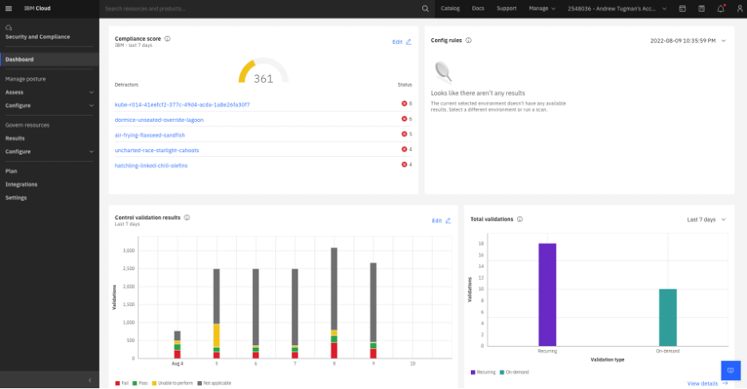

<!-- ------------------------ -->
## Phase 1 – Scan the IBM Cloud Environment

Now that you’ve have a chance to briefly explore the IBM Cloud portal, this next phase will involve a series of steps to conduct an initial security and compliance scan of our environment. We need to understand the current state of our environment – are there any security issues in our IBM Cloud environment that could leave our organization vulnerable to a breach? Are there any misconfigurations in our Cloud resources that could result in us having to pay a fine? We’ll find all of that out by scanning our IBM Cloud environment in via the Security and Compliance Center. 

Start by navigating to “Scopes” in the Security and Compliance Center. You can find “Scopes” under the “Configure” drop-down menu on the left-hand side of your screen, as shown in the screenshot below.

Once you’re there, go ahead and click “Create” to launch the scope creation wizard.

Enter a name for your scope (and optionally, you can add a description). For the purposes of this lab, you may want to include your initials in the name of your scope to make it easier to identify in the lab environment. For example, I might name my scope “alt-scope” or similar.

Note: for complex environments, it’s advised to use strategic naming conventions and to supply descriptions for your scopes. 

Once you’ve done that, click “next.”

In the “target” blade of the wizard, select “IBM Cloud” in the “Environment” drop-down menu, and select “my_scc_credentials” from the “Credentials” drop-down menu. 

Note: For the purposes of this lab, the credentials that your SCC scan needs to run have already been created for you to use (my_scc_credentials). For IBM Cloud environments, creating credentials is done by supplying an IBM Cloud API Key to SCC. We don’t need to complete that step since the credentials are already created!

Once you’ve selected “IBM Cloud” as your environment and “my_scc_credentials” for your credential, click “Next.”

In the “Collectors” blade, you’ll notice several different options. 

Select the collector that aligns with your unique resource group that you identified in the beginning of this lab. You can confirm the collector that you should select based on the name of the collector, or the description. For example, earlier in the lab, we noted that my unique resource group was “rg30.” This means that I should select the last collector shown in the screenshot below, the collector named “8collector-rg29-rg32" because my resource group is between rg29 and rg32. 

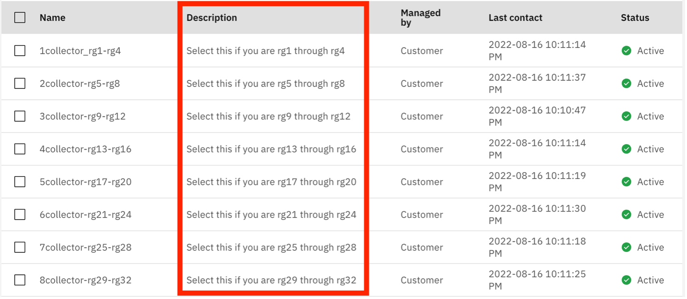

Note: SCC offers 1 IBM managed collector per Cloud account. This means that IBM is managing the server that is responsible for executing the scan against the environment. This saves customers time and resources and makes it even easier to begin using SCC. This managed collector will satisfy the needs of many customers. Advanced users also have the option to manually create a collector by running a provided script on a virtual machine that they manage and/or host themselves. This is useful for customers who are scanning on-premises environments or scanning many different environments. That's actually what we’ve done for today’s lab – we’re using several collectors that we’ve created for you manually to better distribute the computing workload of all of the scans that customers are running today!

Once you’ve selected the appropriate collector based on your individualized resource group, go ahead and click “Next” to proceed to the “Scan” blade.

In the scan blade, you’ll be filling out a few configurations for your scan, and these are listed below. Please also feel free to reference the screenshot below to validate what your scan should look like!

-	Provide a name for your scan
    - We recommend including using your initials as part of your naming convention for your scan here as well.
    - For example, “alt-scan” could be the name of my scan
    - Optionally you may add a description, but this is not required.
-	For “Scan type,” select “Discovery”
-	The “Profile” option will be blank (since we chose “Discovery” for scan type)
-	For “Frequency,” leave this set to 1 day
-	Configure the scan to end “after a number of occurrences,” and change the value to “1” occurrence

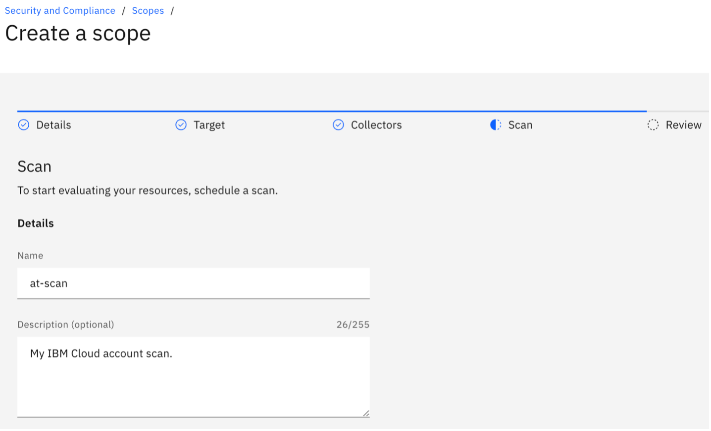
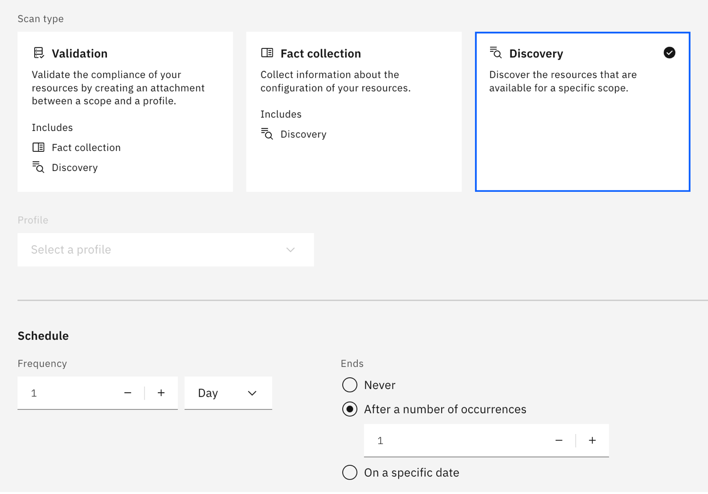

Once your scan matches this configuration in the screenshot above, go ahead and click “Next” to proceed to the final step, the “Review” blade.

This will present each of the options that you’ve selected throughout the scope creation wizard. Below is a screenshot of what yours should look like – go ahead and click “Create” once everything looks good!

Note: The name of your collector may differ from the one in the screenshot below.

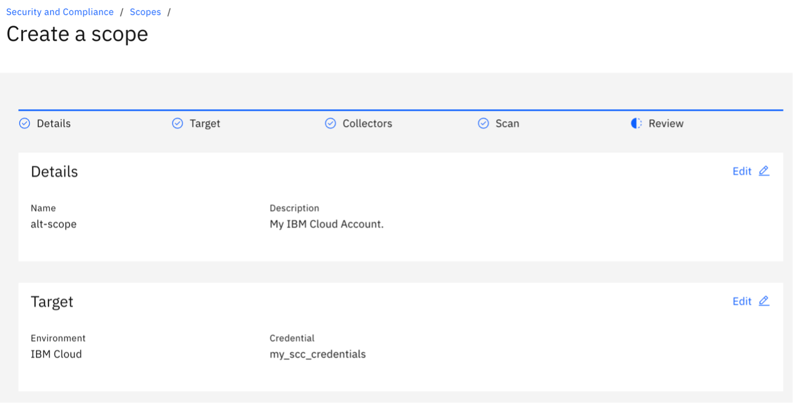

Once you click “Create,” you’ll receive a notice that the scan has started “Discovering Inventory.” You can click the “X” to exit this notification.

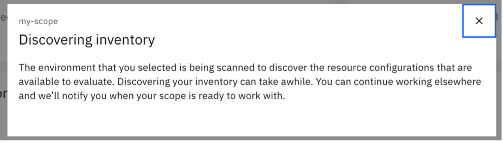

You’ll then notice that the scan has started – your screen should indicate that discovery is in process, and that the collector is activating with green progress bars. Don’t worry that your inventory says it is currently empty, that will soon be updated! 

Note: The name of your collector may differ from the one in the screenshot below.

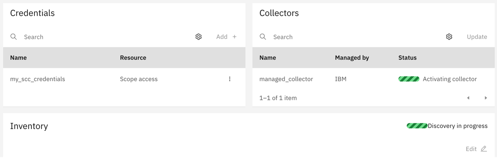

This discovery process should take approximately 3-5 minutes to run.

While we wait for this process to complete, let’s take a moment to ask any questions that you may have. If you weren’t able to complete any of the previous tasks, please let your instructor know! Otherwise, feel free to explore the Cloud portal for another moment or two, or refresh your coffee!

Now, let’s navigate back to SCC. You can easily monitor the progress of your scan by navigating back to “Scopes,” and viewing the “Scan status” column. You’ll see “Discovery completed” in this column when we’re ready to proceed with the next step. There is also an option to refresh the status, feel free to use this while the scan is not yet complete.

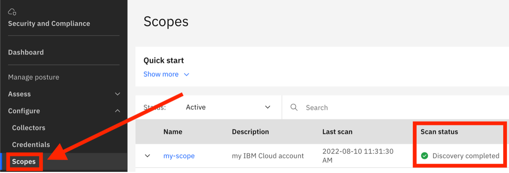

Once the discovery is complete, click into your scope, and select the option to edit your inventory:

Click on your scope:
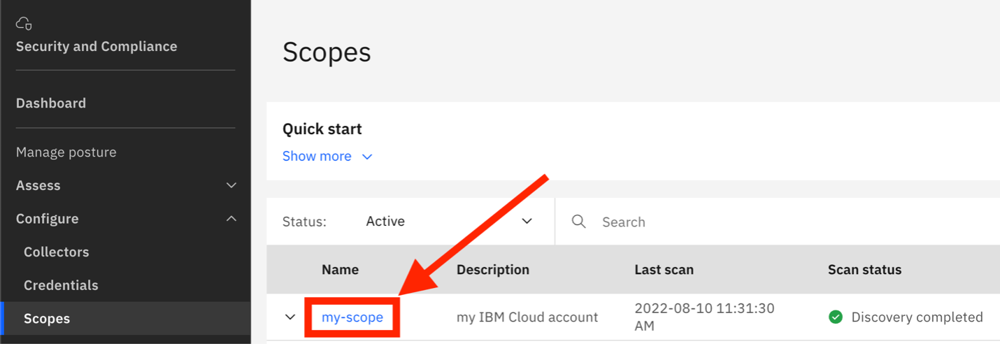

Edit inventory:
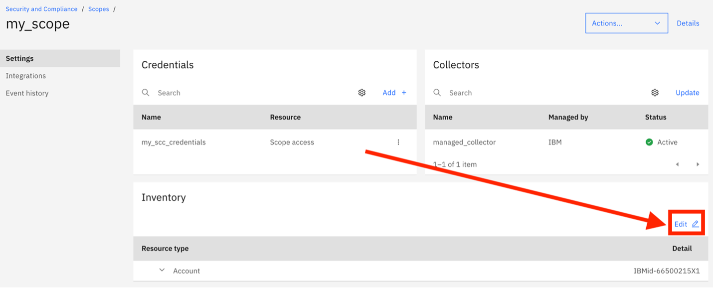

Using the drop-down, update the fields so that only your resource group (that you identified in a previous step) is selected. You can uncheck all of the boxes by clicking the “Account” box at the top, and then expanding the drop-down menu to reselect the box next to your resource group. This step is very important to completing the lab! This ensures that your scan will not take too long to complete.

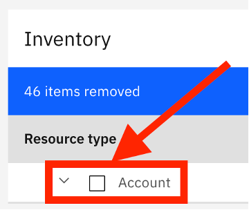

Note: in case you’ve forgotten your resource group, remember that you can navigate to your Resource List to confirm it!

Remember that a resource group is a logical grouping of resources into virtual “bucket.” The resource group only contains metadata about your resources and makes it easy to manage resources collectively. For today’s lab, you only have access to Cloud resources that are within your resource group!

Once again, your inventory should look something like the screenshot below, but with your resource group selected. Go ahead and click “Save” once you’re ready!

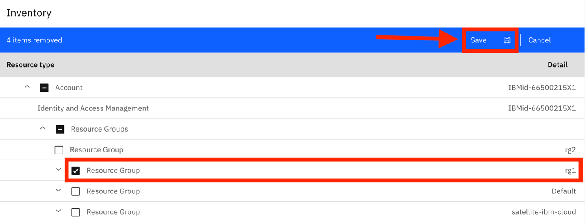

Note: Referring back to the definition of scopes, part of the power of IBM Cloud’s Security and Compliance Center is the ability to assess different environments (or portions of your Cloud accounts) against different controls. Many of our customers have resources in different regions and countries, meaning that their resources in varying locations are subject to equally varying controls and regulations. These customers leverage many different scopes to scan their environments accordingly.

Once you’ve saved your scope to include only your resource group, select “On-demand scan” from the “Actions” drop-down menu in the top right of your screen.

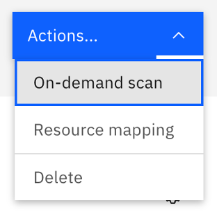

Use the following configurations for your on-demand scan:
-	Scan type: Validation
-	Profile: IBM Cloud for Financial Services v.0.4.0
-	Integrations: Not Enabled

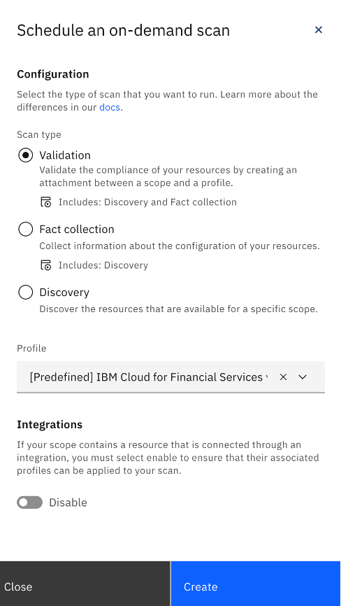

Click “Create.”

The scan will take a few minutes to complete, likely about 8 or 10 minutes. But while we wait, we can perform other Cloud management tasks. Let's continue our exploration of the Security and Compliance Center by drilling into the available goals and profiles.

## Review Available Predefined Profiles

In the top left of your screen, click “Security and Compliance,” as shown in the screenshot below.

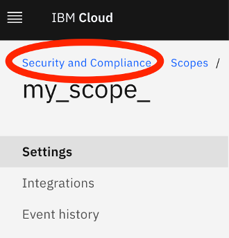

In the Security and Compliance blade on the left, under the “Configuration” drop-down menu, select “Profiles.”

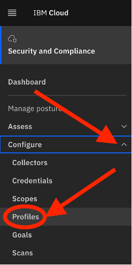

You will be presented with a list of various predefined profiles (collections of controls). 

Controls typically take the form of a security requirement, such as encryption at rest, or 
various other configurations.
	
Below is a quick look at how goals, profiles, and controls are all intertwined. If this seems a bit confusing, don’t worry about it just yet!

Just know that the Security and Compliance Center makes your life easier and lets you know how your environment is performing against these facets, ultimately helping to prevent potential fines, and saving your organization money. 

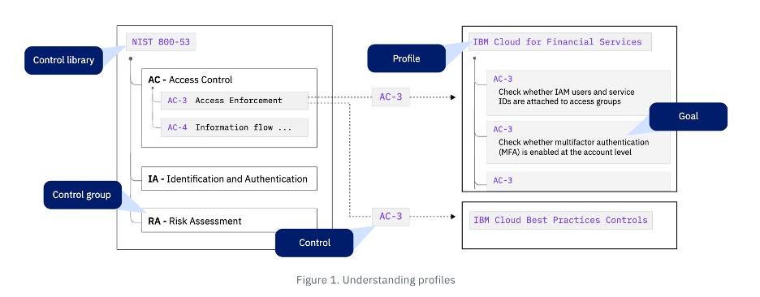

Explore the various predefined profiles available, and drill into one or two that pique your interest.

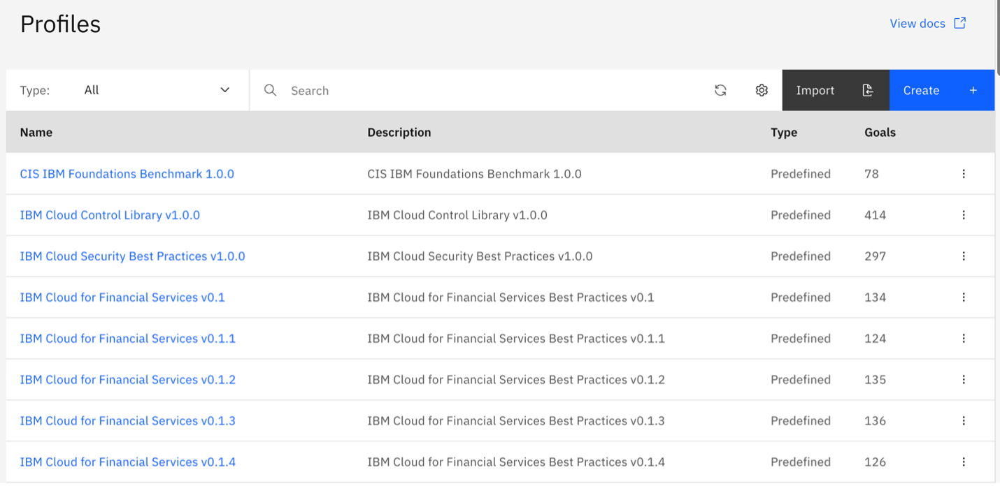

Example: IBM Cloud for Financial Services v0.4.0

You can group the profile by controls, or by categories. For example, let’s group the profile by controls, then review which goals comprise each control. Drill into a few of the controls by clicking the drop-down menu beside of each one. 

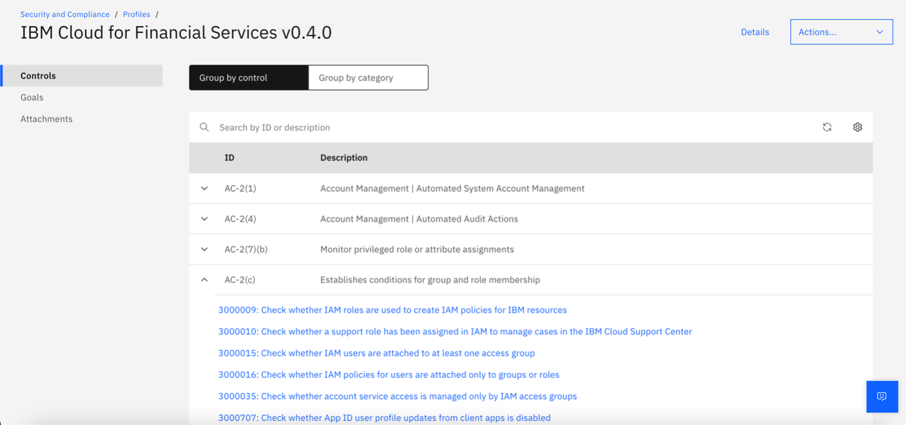

This should give you an idea of the power of preconfigured profiles! Recalling the first section of this lab, profiles are designed to make your life easier. IBM has worked with our industry experts, advisory council, as well as our SCC product team to customize each of the profiles that you saw here. These profiles serve as a working template, and save customers a tremendous amount of time implementing systems to ensure security and compliance. We’re constantly updating and adding more profiles based on the latest controls and regulations, and often work directly with customers to understand their unique needs as we add to our library of profiles.

Now, let’s check back in on the results of our scan.

## Phase 1.1 – Review the Validation Results

Our validation results should be available now. In the Security and Compliance blade on the left side of your screen, select “Validation Results” under the “Assess” drop-down menu.

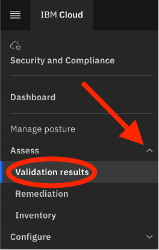

Select the scan that you created previously. 

It might be easiest to search for your scan using the search bar. If you used your initials in the name of your scan, that will be a good way to find yours!

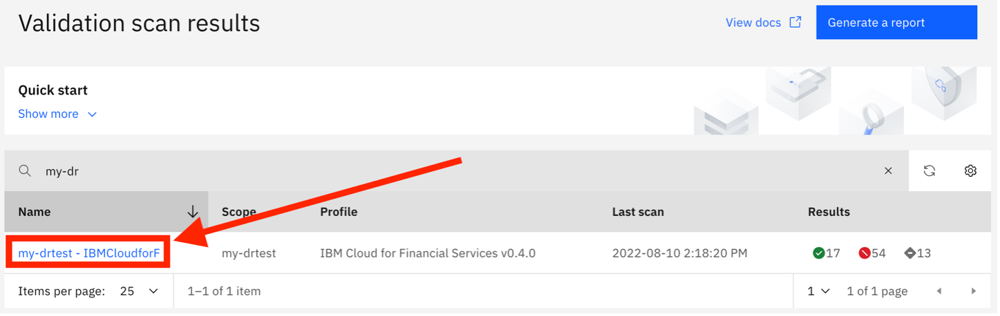

Once you click on your validation results, you’ll be presented with an overview of the outcome of your scan. This provides you with initial insights into how well your environment fared against the IBM Cloud Security Best Practices profile. You’ll be able to see a breakdown of passing controls, failed controls, and other controls that were either not applicable or were not able to be performed. Lastly, we’ll provide you with a breakdown of the severity level of each failed control: critical, high, medium, or low.

Note: The full validation results (including the “Failures” box in the screenshot below) may take a few seconds to load.

Lastly, make a note of your overall compliance score. Your compliance score may differ from the score shown in the screenshot below.

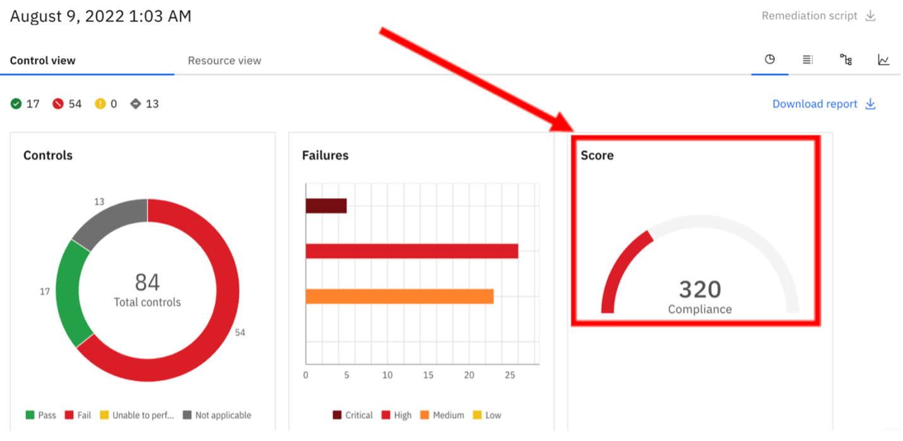

Security and compliance are ongoing and everchanging tasks for organizations. It’s not easy for most organizations to keep track of, much less implement all of the security measures necessary to avoid cyberattacks and costly fines. This is precisely why the Security and Compliance Center provides you with visibility into the severity level of failed controls – companies need a starting point when it comes to understanding where they should be focusing their efforts in terms of implementing security and compliance measures. 

Let’s start by reviewing our most critical failed controls. We can accomplish this by clicking on the dark red bar of the “Failures” graph to view of list of all critical failed controls, as shown in the screenshot below. 

Click on control ID: “AC-4” (Information Flow Enforcement).

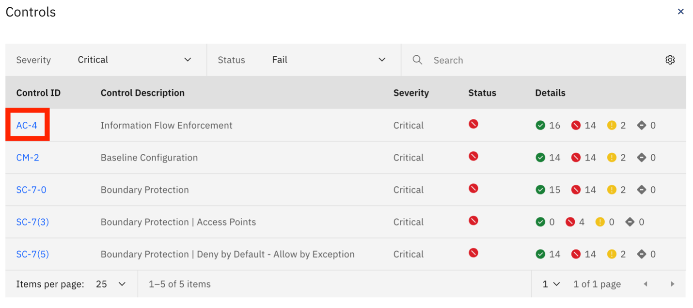

During the next phase of our lab, we’re going to focus on remediating a few goals within the AC-4 Control: Information Flow Enablement. 

Note that each failed goal will be red in our results. But, if we’re able to remediate these and implement a proper configuration, they will be green on the next scan!

Note: Remembering back to our definitions again – a control is a governmental regulation requiring many financial services customers to adhere to certain security measures to protect consumer information. A series of goals will be associated with a given control – each goal is a specific configuration. Customers should strive to pass every goal associated with the controls that they are required to adhere to.

So, we’re going to work on remediating the following goals within the AC-4 control:

- Goal ID: 3000107 – Check whether Cloud Object Storage network access is restricted to a specific IP range
- Goal ID: 3000441 – Check whether Virtual Private Cloud (VPC) network access control lists don’t allow ingress from 0.0.0.0/0 to SSH port
- Goal ID: 3000445 – Check whether Security Groups for VPC doesn’t allow SSH for the default security group

These goals are shown in more detail in the screenshots below, notice again how these are highlighted in red to indicate the goal was failed.

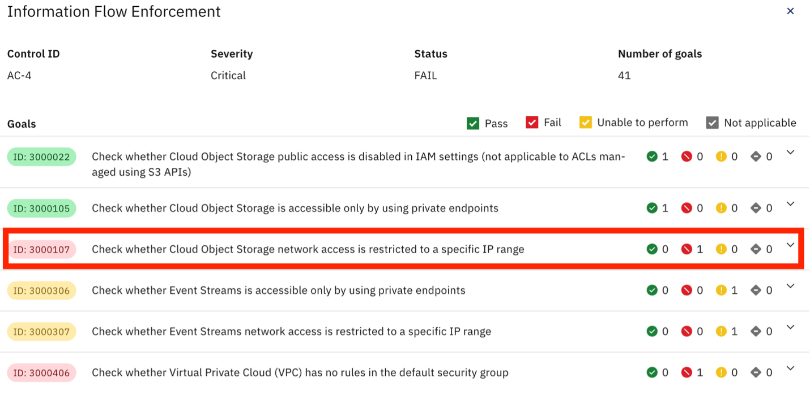

*Scroll down to find the additional controls that we’re focusing on (ID: 3000441 and 3000445):

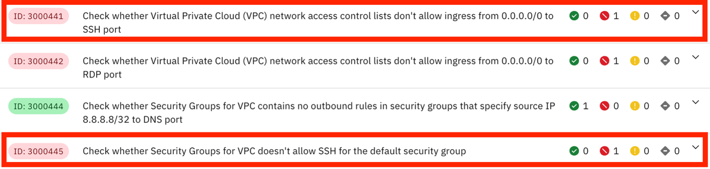

The Security and Compliance Center enables you to easily drill into each failed control to view the impacted resources.

Click into each of these three failed controls to view more details about each failure, and to see the impacted resources. 

Note: You don’t need to memorize the names of the impacted resources! We’ll navigate to them easily over the next few steps in the lab. Just click through each failed goal so that you can see the functionality of SCC!

Note: The names of the impacted resources in your environment may differ from the screenshots below.

Goal ID: 3000107 – Check whether Cloud Object Storage network access is restricted to a specific IP range

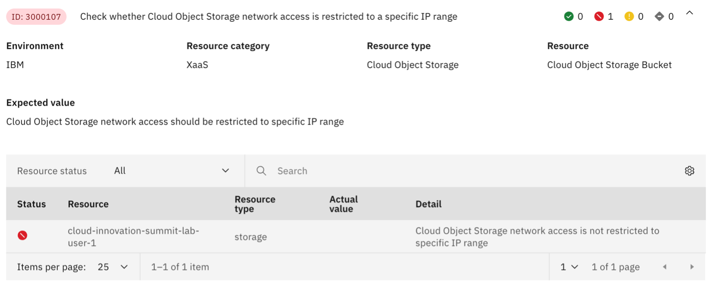

Goal ID: 3000441 – Check whether Virtual Private Cloud (VPC) network access control lists don’t allow ingress from 0.0.0.0/0 to SSH port

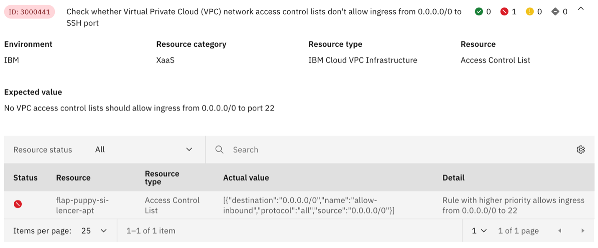

Goal ID: 3000445: Check whether Security Groups for VPC doesn’t allow SSH for the default security group

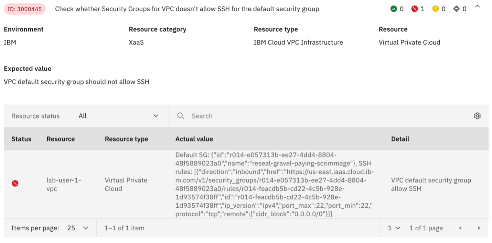

Now that we have an idea of some of the most critical issues in our environment that could result in security incidents or hefty fines, let’s take action and remediate these issues. 

## Phase 1.2 – Remediate the IBM Cloud Environment

1.2.1 Remediate Goal 3000107

Let’s start by navigating to the impacted Cloud Object Storage (COS) bucket.

In the top left of your screen, click on the following icon to use the flyout menu once again:

Then click on “Resource List” from the flyout menu.

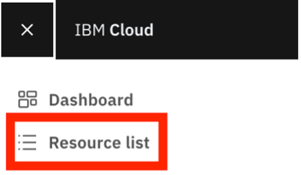

Under the “Storage” section down-down menu, select the Cloud Object Storage (COS) instance.

Note: The “impacted” COS instance will be the only bucket that you can see!

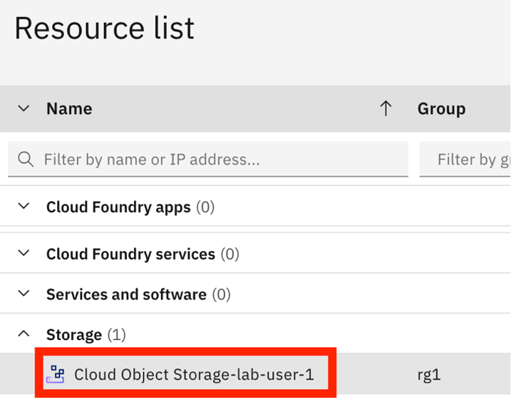

From the COS instance, click on the name of the bucket (which may differ slightly than the name shown in the screenshot below): This will be the only bucket in the COS instance.

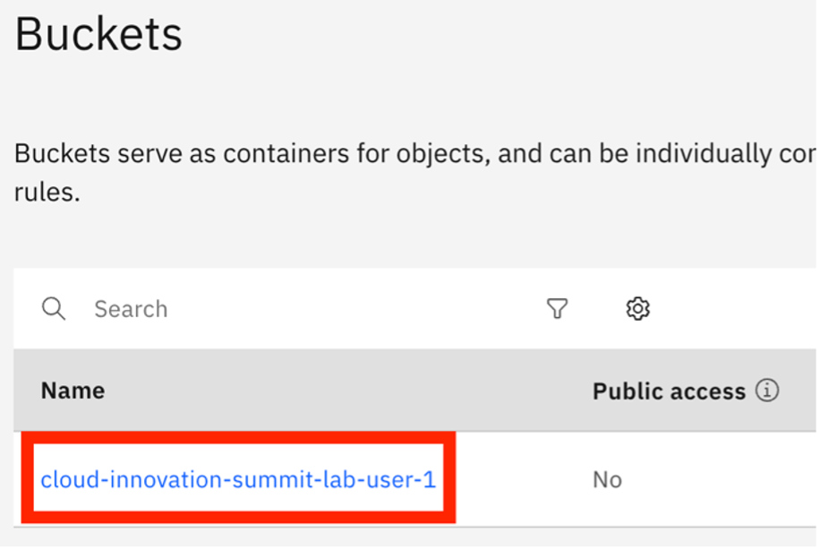

Navigate to the “Permissions” section of the bucket, and expand the “Firewall (legacy)” down-down menu.

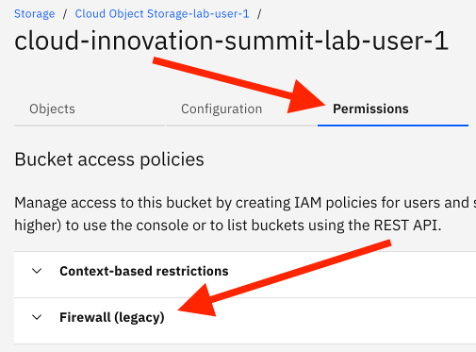

Note: for the purpose of this lab, we’ll be using standard firewall rules to secure our environment. For more highly configurable routing rules, consider using Context-based restrictions. Context-based restrictions expand on traditional firewall rules and enable you to filter traffic based on IP address ranges, specific VPCs, CIDR blocks, etc.

Copy your machines IP address, which you can do simply by clicking on the IP address listed in the “Firewall (legacy)” section. Then select “Add.”

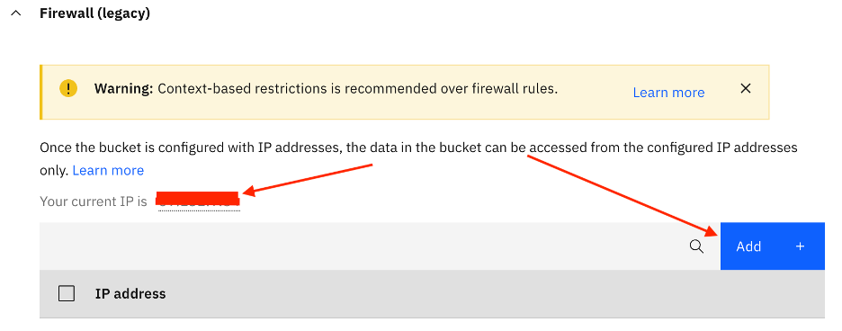

Note: You will need this IP address again later – when you do, you should simply be able to paste it again, as the IP address should remain in your machine’s clipboard until that time.

Select “Add” again, paste the IP address into the box, and finally, click the last “Add” button.

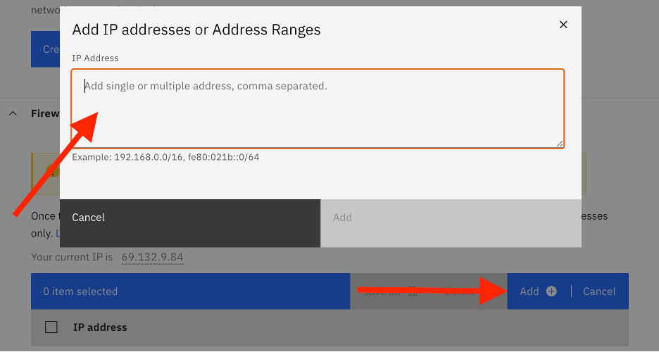

Click “Save All."

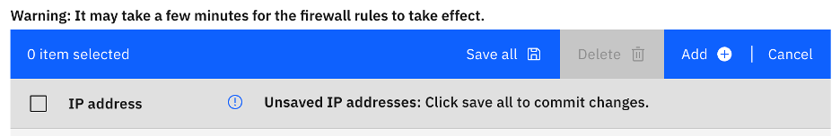

You may notice a brief message pop up in the top right of the Cloud Portal confirming this step was completed:

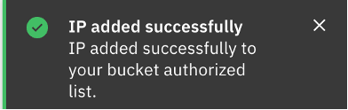

Regardless, make sure your machine’s IP address is now visible in the “Firewall (legacy)” section:

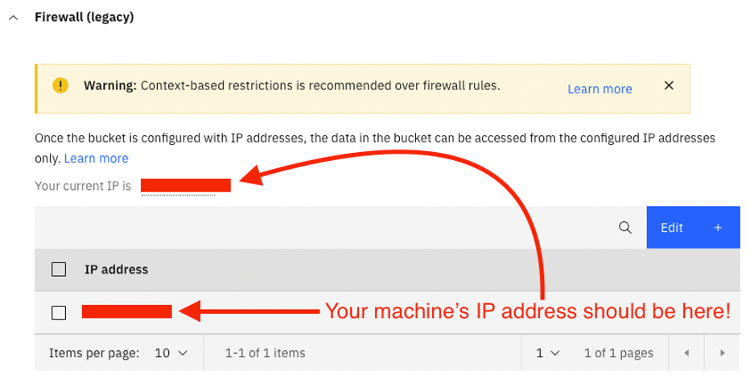

Once it is, we’re ready to move to the next step!

Note: Let’s think back briefly to what our goal requires, and what we’ve done here in this remediation step. Recall that goal 3000107 stated: “Check whether Cloud Object Storage network access is restricted to a specific IP range.” Prior to this remediation step, in theory, this bucket had no firewall rules in place, meaning that virtually anyone on the internet could have accessed its contents. Adding our machine’s IP address to the firewall rules now ensures that we’re the only people that can access the contents of this bucket, which could hold very sensitive information! 

Note: In many practical settings, adding a single IP address to the firewall rules is likely too restrictive. You may need to grant access to various individual users, CIDR blocks, or other services to ensure that all users and applications that require access to the objects can do so. We’ve simplified this for the sake of this lab by merely adding our IP address.

1.2.2 Remediate Goal 3000445

The next goal that we’re going to remediate is 3000445 (the third goal identified initially).

Recall that goal 3000445 stated: “Check whether Security Groups for VPC doesn’t allow SSH for the default security group.”

Security Groups in IBM Cloud provide us with a way to filter traffic for a virtual server instance. The individual machine within the network (VPC) is what we’re concerned about when it comes to security groups (we’ll talk more about Access Control Lists (ACLs) and the differences between these in the next section).

We know from our initial Security and Compliance Center scan that we failed this goal, which means that our default security group is allowing access to our machine. Specifically, we know that it’s allowing access via Secure Shell (SSH), a network protocol that uses port 22 to establish a connection, commonly used for accessing Linux virtual machines.

Let’s first navigate to the impacted security group (that SCC noted a failure for) and see what’s going on!

From the flyout menu on the left, expand “VPC Infrastructure,” then select “Security Groups” from the list (you may need to scroll down on the list!):

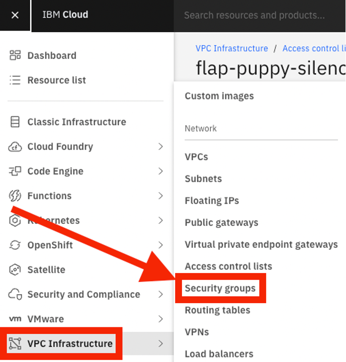

When you get to Security Groups, if you don’t see any resources, first make sure that your Region is set to your individualized Region for this lab.

Your individualized Region for this lab will be one of the following regions: 
-	Dallas 
-	Toronto 
-	São Paulo

Once your region is configured, then you’ll be able to see your impacted Security Group.

Note: For the purposes of this lab, this impacted security group is the only security group that you’re able to see! The name of the security group and the region may differ from the screenshots below.

Go ahead and click on the security group:

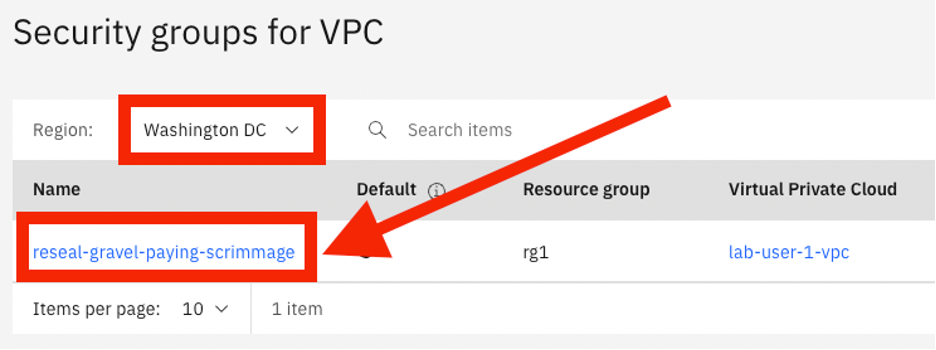

Here, you can view basic information about the security group. 

Click on the “Rules” tab near the top of the page:

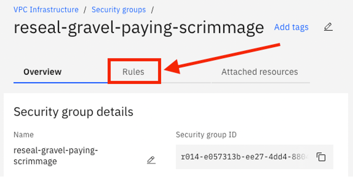

Currently the security group rules are allowing anyone to attempt to Secure Shell (SSH) into our virtual server instance that is using this security group. From the “Rules” tab, select the option to “Edit” the inbound SSH rule (port 22) using the ellipses. 

Update the SSH rule to only allow your machine’s IP address to SSH.

You’ll need to change the “Source type” to “IP Address,” then paste your IP address into the field, as shown in the screenshot below. Remember, your IP address should already be in your machine’s clipboard and ready to paste here.

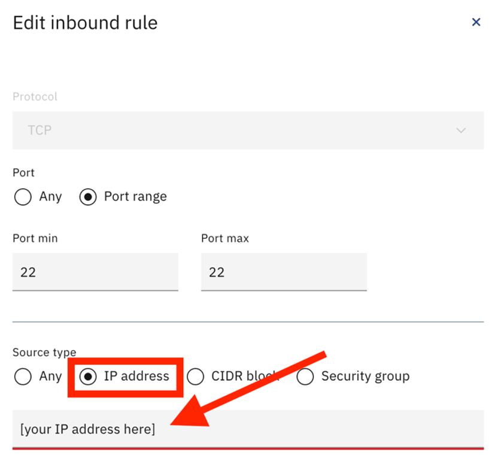

Once you’ve done that, go ahead and click “Save.” You may notice a notification that the security group rule was updated:

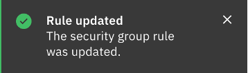

Regardless, your updated inbound rules should look like the screenshot below, where your IP address appears in in the “Source” column of the SSH (port 22) rule.

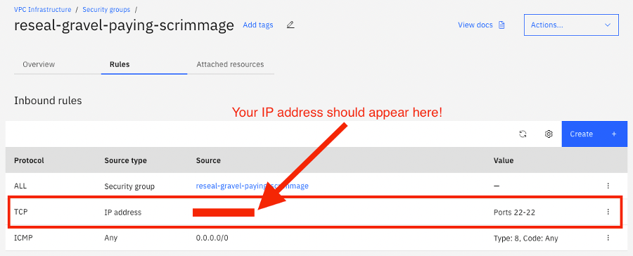

Great! Now we’ve made sure that our virtual server instance is only accessible via SSH from machine’s IP address, instead of from the entire internet! Even though our machine had a password and private key, you can’t be too careful. Hackers can easily crack passwords and can even decrypt keys using some advanced topics in the realm of cryptography. These topics are out of scope for today’s lab, but you should certainly research brute force password attacks and cryptography when you have some time!

We need to make sure we take all precautions when protecting our resources, otherwise we could be violating industry regulations and subject to fines, or even worse, vulnerable to a breach. In today’s world, companies should be well aware of the fact that the average security exploit could cost over $4M. This has been reported by IBM, among many other leaders in cybersecurity: 

https://newsroom.ibm.com/2021-07-28-IBM-Report-Cost-of-a-Data-Breach-Hits-Record-High-During-Pandemic
https://www.ibm.com/security/data-breach

That’s a lot more than a few pesky fines from violating governmental regulations, but regardless, the IBM Cloud Security and Compliance Center is here to help customers prevent misconfigurations that could result in tons of wasted money. How much could a misconfiguration cost your organization? Over $4M? Let’s not find out.

Back to our environment – updating the security group rules to deny all traffic over port 22 (except for traffic coming from our machine) is a far better security measure, and I’m sure the Security and Compliance Center will agree with us on our next scan!

But first, we have one more goal to remediate. What if we had multiple virtual server instances in our Virtual Private Cloud (VPC)? Remember, updating the rules of our security group secures only the machines that are using that security group. How do we ensure all of the virtual server instances within our VPC are denying unintended and potentially malicious traffic over port 22? Let’s discuss Access Control Lists (ACLs).

1.2.3 Remediate Goal 3000441

Now, let’s work on remediating the final goal of this exercise, goal 3000441. Remember that goal 3000441 was: “Check whether Virtual Private Cloud (VPC) network access control lists don’t allow ingress from 0.0.0.0/0 to SSH port.” Make note that an ACL is what defines access (incoming and outgoing traffic) for an entire VPC, which could include numerous virtual server instances depending on the defined CIDR block/number of addresses. Lastly, remember that we failed this goal on our initial scan. 

Therefore, before we even look at the ACL, we know from the Security and Compliance Center that our ACL is, in fact, allowing far too much access to ALL of the resources in this VPC. To be clear, our ACL is actually allowing the entire internet to access our VPC resources!! This is what the CIDR block 0.0.0.0/0 means – our VPC is open to connections from any IP address. 

So, how do we fix this?

First, navigate to Access Control Lists (ACLs).

Using the flyout menu once again, expand “VPC Infrastructure,” and locate “Access Control Lists” from the list of options, as shown in the screenshot below.

Note: You may not even need to use the flyout menu here if you’re still looking at your Security Groups or other parts of VPC Infrastructure!

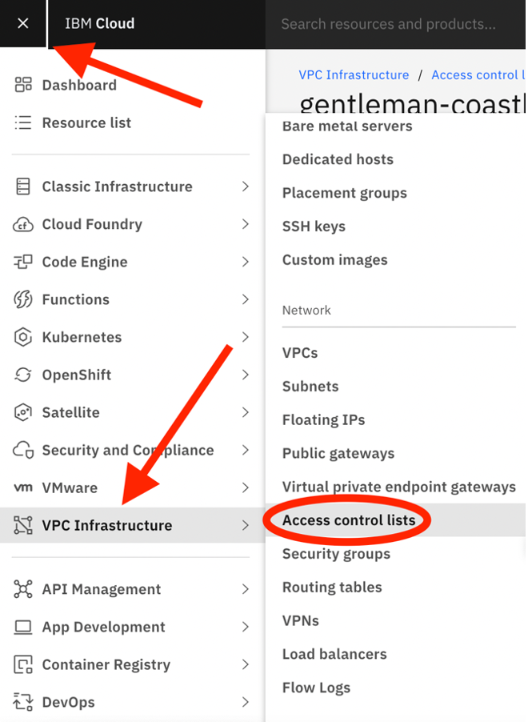

Once again, make sure that your Region is set to your individualized Region for this lab, the same Region that we noted in the previous section.

Once your region is set, you should be able to see a single ACL.

Go ahead and click on this ACL!

Note that your region and the name of your ACL may differ from the ones in the screenshot below.

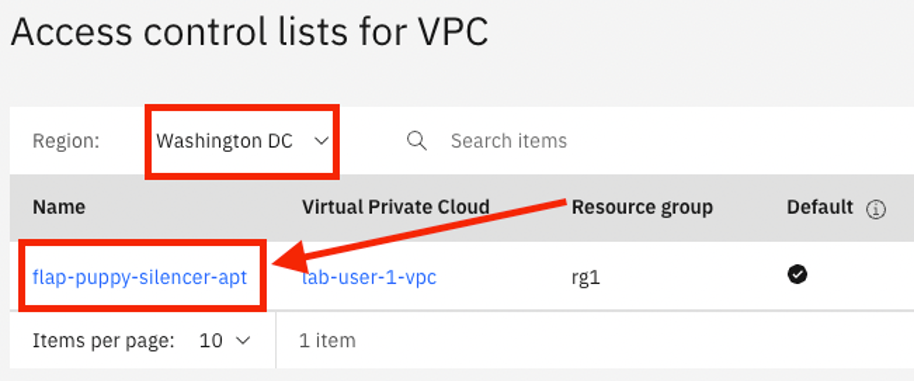

Once you’ve clicked into your ACL, you’ll notice what we were referring to before – the ACL has an “allow” rule with the “source” set to “Any IP.” This is precisely what we need to update to ensure our resources are secure and that our organization is compliant.

Now, under inbound rules, click the ellipses (as shown in the screenshot below), and select “Edit.”

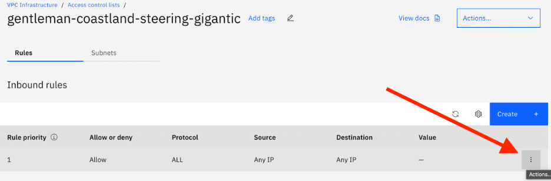

Under “Source,” select “IP or CIDR,” paste your machines IP address in the box, then click “Save” in the bottom right. 

Note: Your IP address should still be in your clipboard as it was in the previous step, so try pasting it here! If the IP address was pasted accordingly, please skip over the next note just below!

Note: If for some reason your IP address is not the last item in your clipboard, you can always navigate back to Cloud Object Storage to retrieve it. There are alternative ways to retrieve your IP address, but this may be the easiest for today’s exercise. For reference, you can navigate back to Cloud Object Storage by using the flyout menu, then selecting “Resource List,” scroll down to “Storage” and expand this section, click on this COS instance, click into the bucket again, click “Permissions,” and expand the “Firewall (legacy)” drop-down menu.

Once again, make sure your IP address is present in the “IP or CIDR” box, as shown in the screenshot below, then click “Save.”

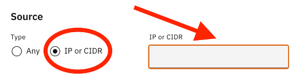

You may notice a brief notification in the top right of the Cloud portal, indicating that the rule was successfully updated:

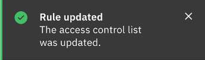

Regardless, when you view your ACL now, you should see your machine’s IP address listed as the “Source” for the inbound rule:

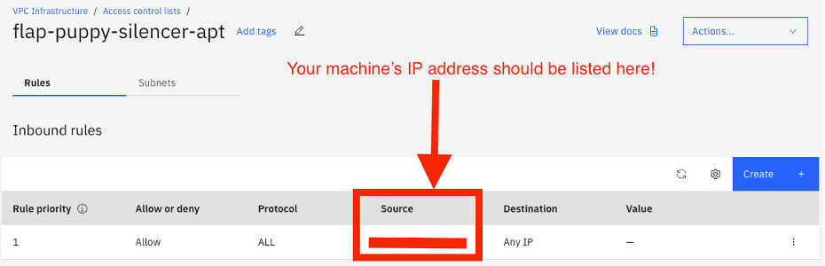

As a quick recap, what we’ve effectively done here is updated our Access Control List to only allow our machine to access the virtual server instances in our VPC, as opposed to allowing the entire internet (which was represented as 0.0.0.0/0 or “Any IP”)! I imagine that the Security and Compliance Center will be much happier with our ACL after this.

Let’s see!

## Phase 1.3 – Rescan the IBM Cloud Environment

It’s time to use the Security and Compliance Center to rescan our IBM Cloud environment and to see if our remediation steps were successful in helping secure our environment. 

Navigate back to “Scopes” within Security and Compliance Center.

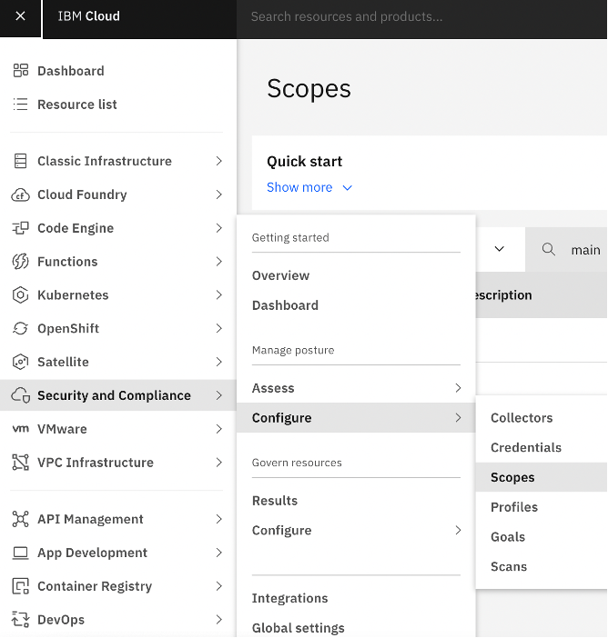

Click on the ellipses next to the scope that you created previously, and select On-demand scan.

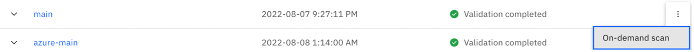

Just like before, select “Validation” for scan type, “IBM Cloud for Financial Services v0.4.0” for Profile, and do not enable integrations. Your scan should look like the screenshot below! Once it does, click “Create.”

Once you click create, you’ll see that the scan has started!

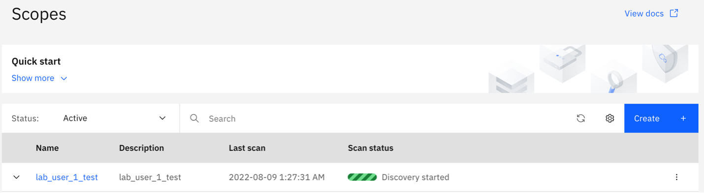

Note: For the purposes of this lab, we’ve been using “On-demand Scans.” As the name suggests, these are scans that you can manually run yourself. 

One of the great features of SCC is that you can automate this process – you can schedule scans to run on a continuous basis. This saves customers a lot of time managing manual processes involved in maintaining security and compliance measures for their organization.

This scan will take approximately 8 minutes to complete given the number of users we have in our lab. Be sure to stop and consult your instructor if you had any issues completing these steps, or if you have any questions about SCC as a whole. Otherwise, feel free to take a few moments to explore other aspects of SCC, the IBM Cloud environment that we’ve been working in today, or refresh your coffee!

## Phase 1.4 – Review the Latest Scan and Evaluate Drift

Now that the scan has completed, let’s see if we were able to improve the security posture of our environment and prepare for compliance reporting.

Navigate back to the (latest) validation results:

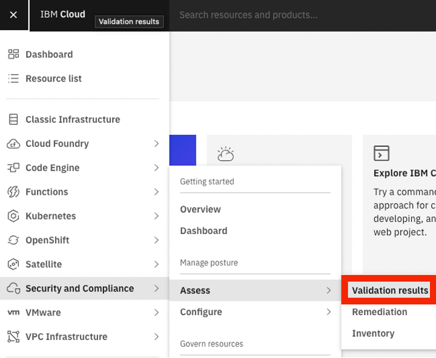

Select your scan from the list. The name of your scan may differ from the screenshot below.

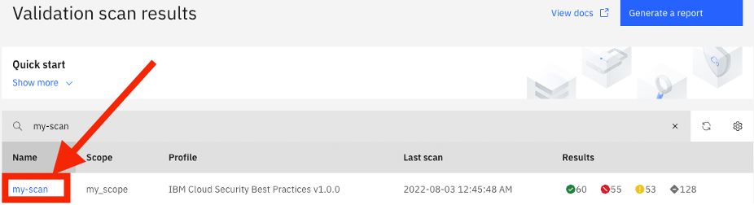

Take a moment to review the latest scan! In the top left, make sure you’re looking at the scan with the most recent timestamp. Also, take note of how much your compliance score increased from your first scan! 

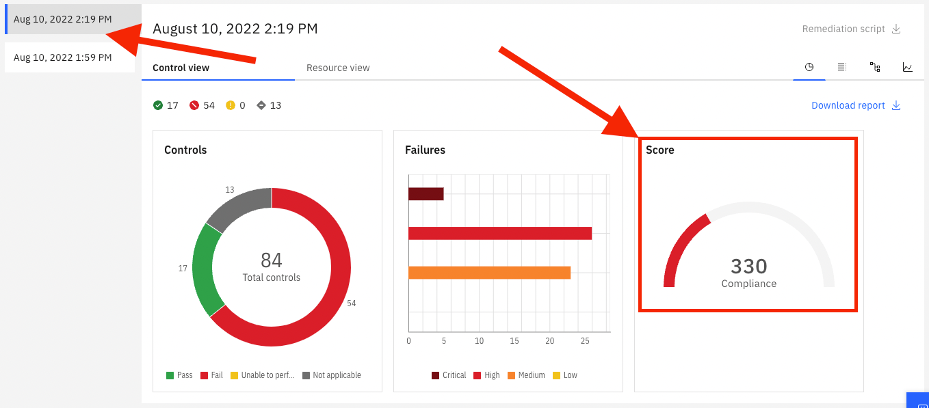

Let’s take a look at the individual goals that we worked to remediate and see if we were successful. 

Click on the dark red bar in the “Failures” graph as we did previously in the lab:

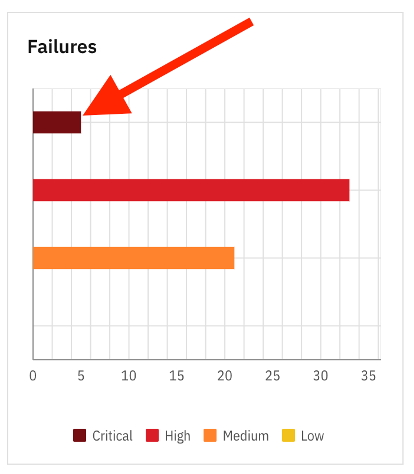

Click on our AC-4 control once again:

Scroll down and observe the following goals that we worked on, and click into each one:

- Goal ID: 3000107
- Goal ID: 3000441
- Goal ID: 3000445

Goal 3000107: Notice that this goal is now passing, indicated by the green ID banner and the green check mark next to the individual COS bucket. SCC was able to see that only our IP address is allowed to access this bucket, which is a great security measure to have in place. We’ve passed this goal!

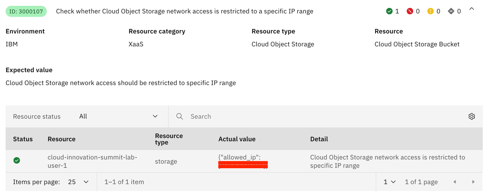

Goal 3000441: Similarly, after updating our ACL, our SCC scan picked up on our new configuration. It knows that we are only allowing access into our VPC from our machine!

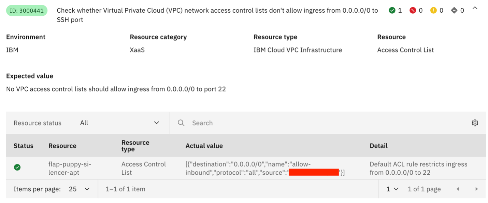

Goal 3000445: Lastly, we passed this goal as well! SCC is much happier with our security group after restricting access to only our machine, as opposed to leaving it accessible by the entire internet.

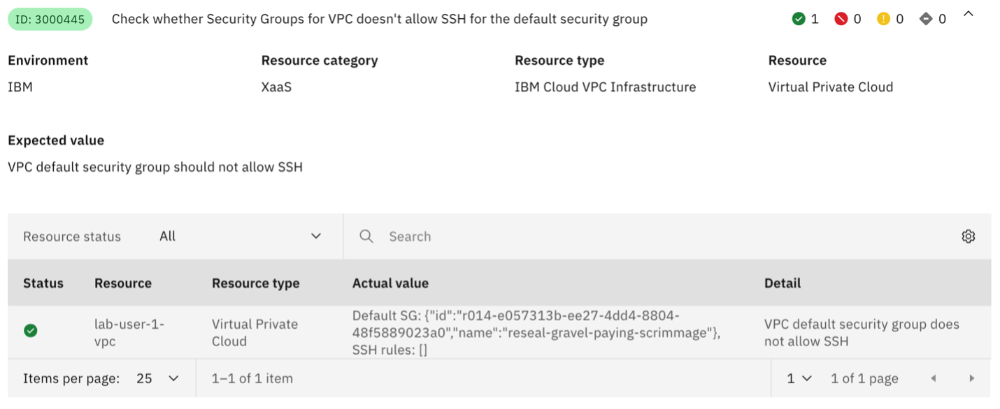

Finally, using the drift view in SCC, we make it easy to review how your environment has improved over time based on your remediation steps. You can go ahead and click out of the AC-4 control, then and click on the drift view icon (as shown in the screenshot below) for a visual representation of the improvements we made between the scans we ran in this lab. Customers find tremendous value in being able to show progress over time – notice how much we improved after addressing only a few goals!

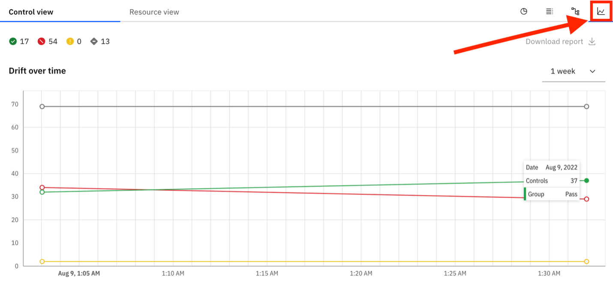

Congratulations! You've completed the hands-on portion of this lab!

The remainder of this document is further exploration of SCC to highlight a few additional features and value propositions.

## Phase 2 – Scan the Microsoft Azure Environment
